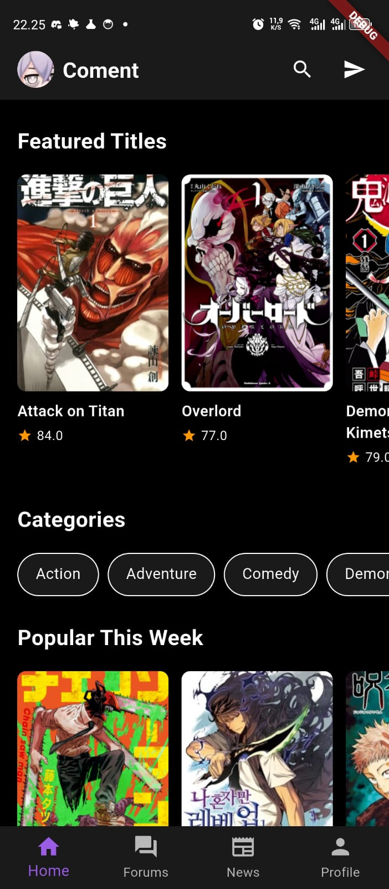
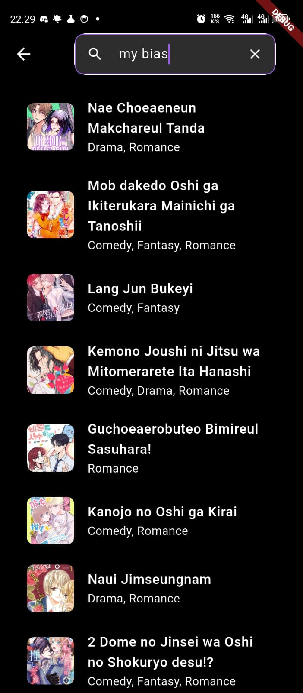
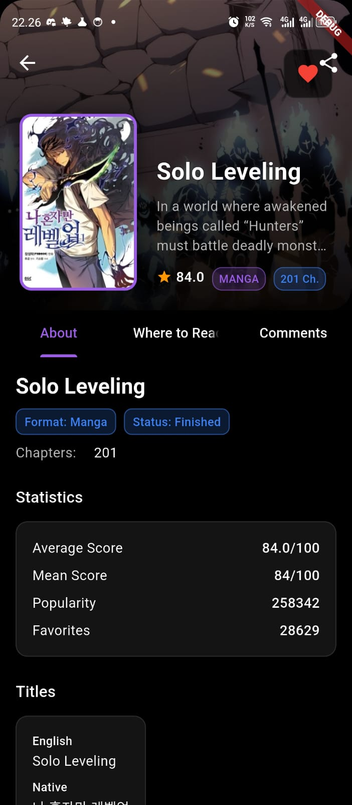
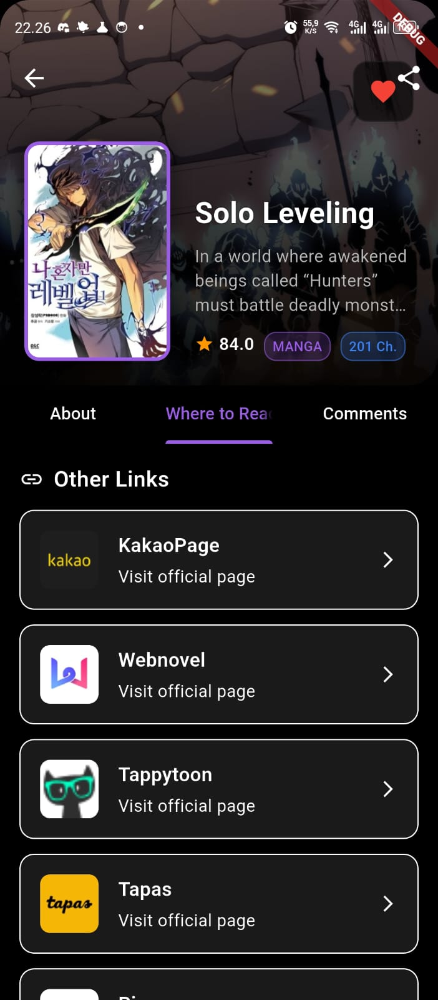
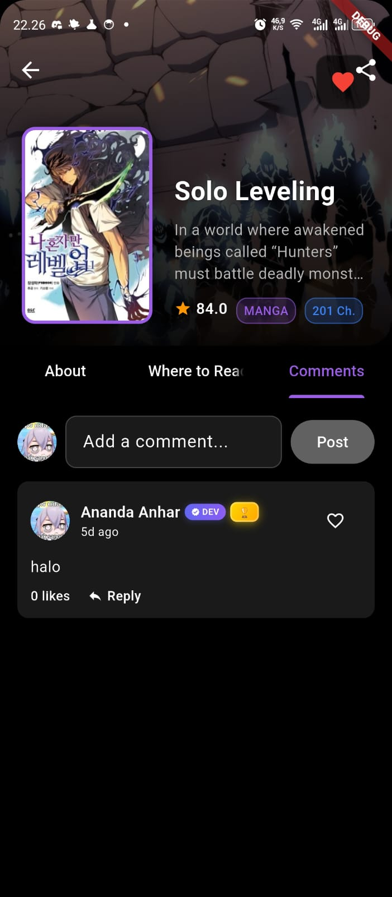
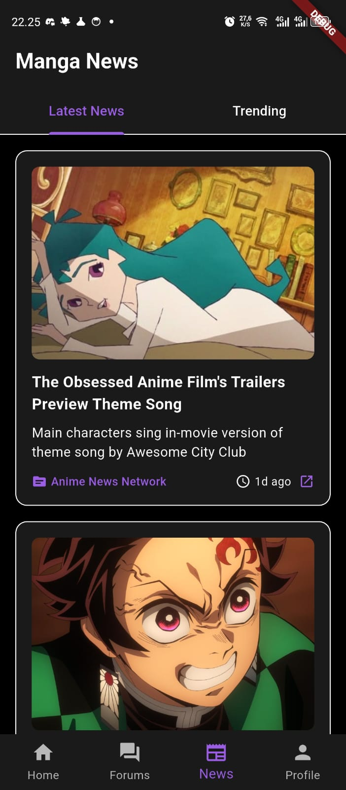
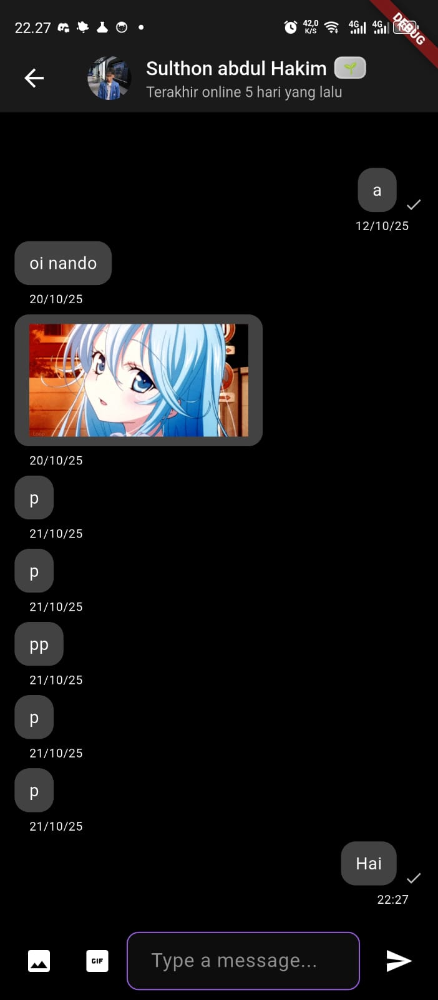
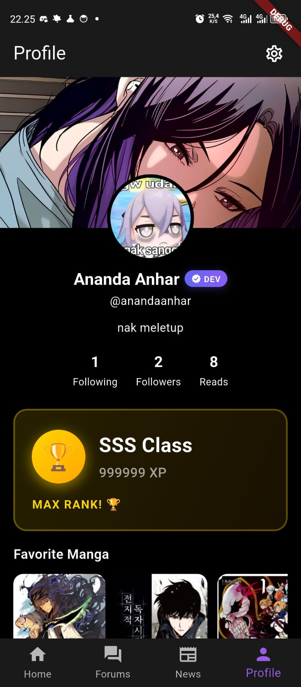
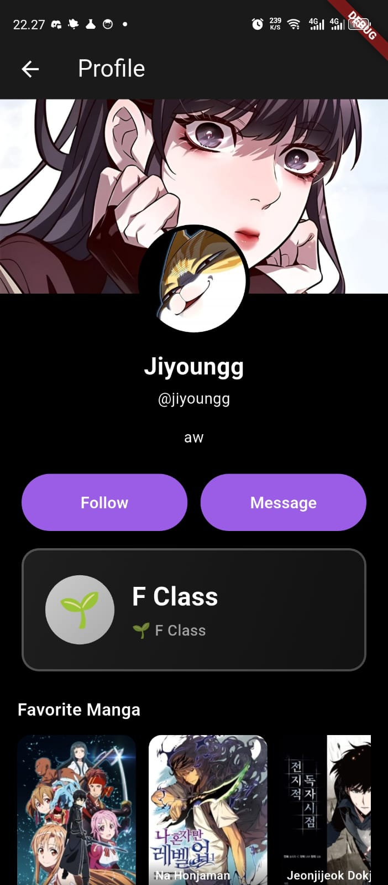

# 📱 Coment - Modern Manga Discovery Experience

<div align="center">


**A beautiful Flutter app for discovering and exploring manga with social features**

[Features](#-features) • [Screenshots](#-screenshots) • [Tech Stack](#-tech-stack) • [Getting Started](#-getting-started)

</div>

---

## ✨ Features

### 📚 **Manga Discovery**
- Explore featured, popular, and trending manga
- Search manga with real-time results
- Browse by genres and categories
- Detailed manga information with synopsis, characters, and relations
- "Where to Read" links for easy access

### 💬 **Social Features**
- **Comments System**: Discuss manga with nested replies
- **Forums**: Create and join community forums
- **Direct Messaging**: Private chats with friends
- **User Profiles**: Customizable profiles with favorite manga showcase

### 📰 **News & Updates**
- Latest manga news and articles
- Stay updated with the manga community

### 🎯 **Personalization**
- Track reading status (Want to Read, Reading, Completed, etc.)
- Favorite manga collection
- Reading lists and recommendations
- XP system with user rankings

### 🔔 **Notifications**
- Real-time notifications for messages and mentions
- In-app notification handling
- Firebase Cloud Messaging integration

---

## 📸 Screenshots

### Home Screen
<div align="center">
  
</div>
<p align="center"><em>Discover featured, popular, and trending manga</em></p>

### Search & Results
<div align="center">
  
</div>
<p align="center"><em>Powerful search with instant results</em></p>

### Manga Detail
<div align="center">
  
</div>
<p align="center"><em>Comprehensive manga information and details</em></p>

### Where to Read
<div align="center">
  
</div>
<p align="center"><em>Find where to read your favorite manga</em></p>

### Comments
<div align="center">
  
</div>
<p align="center"><em>Engage in discussions with nested replies</em></p>

### News Feed
<div align="center">
  
</div>
<p align="center"><em>Stay updated with latest manga news</em></p>

### Forums
<div align="center">
  
</div>
<p align="center"><em>Join community discussions in forums</em></p>

### Direct Messages
<div align="center">
  
</div>
<p align="center"><em>Private conversations with friends</em></p>

### Your Profile
<div align="center">
  
</div>
<p align="center"><em>Customize your profile and showcase favorites</em></p>

### User Profile
<div align="center">
  
</div>
<p align="center"><em>View other users' profiles and favorites</em></p>

---

## 🛠 Tech Stack

### **Frontend**
- **Flutter** 3.9+ - Cross-platform UI framework
- **Dart** - Programming language
- **Material Design 3** - Modern UI components

### **Backend & Services**
- **Firebase Authentication** - User authentication
- **Cloud Firestore** - Real-time database
- **Firebase Storage** - Image storage
- **Firebase Cloud Messaging** - Push notifications
- **Firebase Crashlytics** - Error tracking
- **Firebase Analytics** - Usage analytics
- **Firebase App Check** - API abuse prevention

### **External APIs**
- **AniList GraphQL API** - Manga data
- **Giphy API** - GIF search
- **Cloudinary** - Image hosting

### **State Management**
- **Provider** - State management solution
- **StreamBuilder** - Real-time data streams

---

## 🚀 Getting Started

### Prerequisites
- Flutter SDK 3.9 or higher
- Dart SDK 3.9 or higher
- Android Studio / VS Code
- Firebase project setup
- Google Sign-In configuration

### Installation

1. **Clone the repository**
   ```bash
   git clone https://github.com/yourusername/coment.git
   cd coment
   ```

2. **Install dependencies**
   ```bash
   flutter pub get
   ```

3. **Configure Firebase**
   - Add `google-services.json` to `android/app/`
   - Add `GoogleService-Info.plist` to `ios/Runner/`
   - Configure Firebase Authentication
   - Set up Firestore database rules

4. **Configure environment variables**
   - Create `.env` file in project root:
     ```
     GIPHY_API_KEY=your_giphy_api_key
     FIREBASE_APPCHECK_DEBUG=false
     ```

5. **Run the app**
   ```bash
   flutter run
   ```

---

## 📁 Project Structure

```
lib/
├── core/               # Core utilities and constants
│   ├── constants.dart
│   ├── theme.dart
│   ├── logger.dart
│   └── firebase/      # Firebase initialization
├── data/
│   ├── models/        # Data models
│   ├── services/      # API and Firebase services
│   └── repositories/  # Data repositories
├── state/             # State management (Providers)
├── ui/
│   ├── screens/       # Screen widgets
│   └── widgets/       # Reusable widgets
└── notifications/     # Notification handling
```

---

## 🔒 Security Features

- ✅ Firebase Security Rules for Firestore
- ✅ Firebase Security Rules for Storage
- ✅ User authentication required for sensitive operations
- ✅ API keys stored in environment variables
- ✅ Firebase App Check for API protection
- ✅ Input validation and sanitization
- ✅ Error handling without exposing sensitive data

---

## 📝 License

This project is private and proprietary. All rights reserved.

---

## 👤 Author

**Nandogami Team**

---

## 🙏 Acknowledgments

- [AniList](https://anilist.co/) for manga data API
- [Giphy](https://giphy.com/) for GIF integration
- [Firebase](https://firebase.google.com/) for backend services

---
